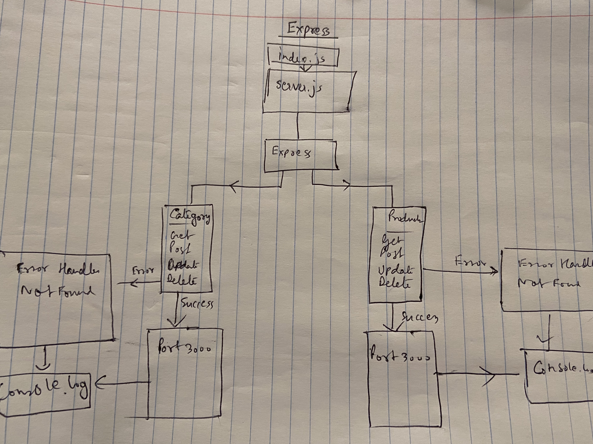

# LAB - 07

## Express

### Author: Shubham Majumdar

### Links and Resources
* [submission PR](https://github.com/Shubham-401n16/Lab07/pull/1)
* [Github Actions](https://github.com/Shubham-401n16/Lab07/actions)

#### Documentation
* [api docs](http://xyz.com/api-docs) (API servers)
* JSDoc Comment Required for all modules and functions in all .js files

### Setup
#### `.env` requirements (where applicable)
* `PORT` - 3030
* `MONGODB_URI` - 

#### How to initialize/run your server app (where applicable)
* `npm start`
* npm init
* npm i dotenv
* npm i @code-fellows/supergoose jest
* npm i express cors morgan dotenv
* npm i -D jest @code-fellows/supergoose
  
#### Tests
* How do you run tests?
npm test

#### UML

